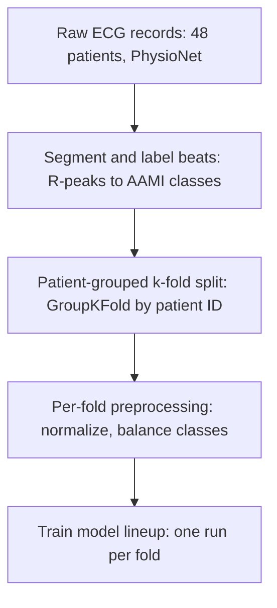
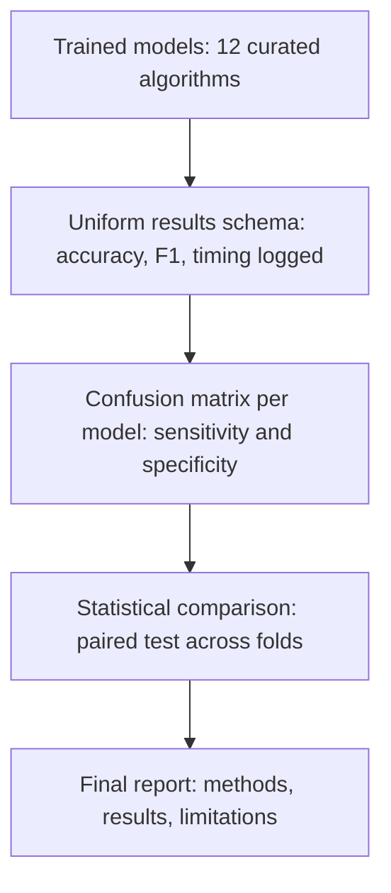
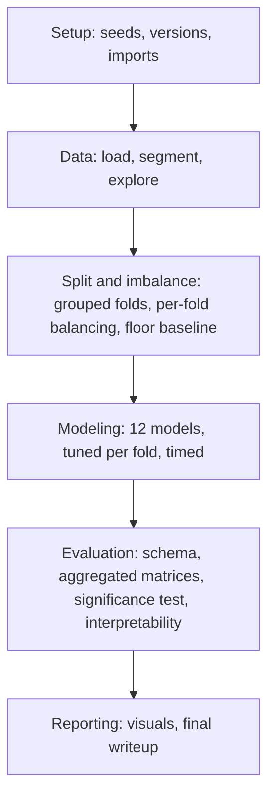

# Making Of: Deep Learning for Arrhythmia Heartbeat Detection
### A research & ideation log — MIT-BIH Arrhythmia Database

---

## 1. The Starting Point

The project began with the MIT-BIH Arrhythmia Database and a rough instinct rather than a plan: use a neural network — possibly a Transformer, possibly a recurrent network — to turn raw ECG signal into a predictable alert. Alongside that, a second, more classical instinct was also on the table: fit a baseline "normal" line to a patient's heartbeat and flag anything that deviates far enough from it, using nothing more exotic than linear regression.

Rather than committing to either idea immediately, the first step was to treat this as open-ended research: what does the literature actually say is possible with this dataset, and what would a rigorous version of this project look like?

## 2. First Correction: Getting the Clinical Framing Right

Before any architecture work, one terminology issue needed fixing: **arrhythmia is not the same thing as a heart attack.** MIT-BIH labels irregular heart *rhythms* (the AAMI classes N/S/V/F/Q — normal, supraventricular ectopic, ventricular ectopic, fusion, and unknown beats), not myocardial infarction, which is a blocked-artery event usually identified through ST-segment changes on a different dataset (PTB-XL / PTB Diagnostic ECG Database). The two can co-occur clinically, but they are diagnosed from different signal features entirely.

This mattered early on: it fixed the scope of the project (rhythm classification, not infarction detection) and it's the kind of precision a professor notices immediately in a writeup.

## 3. Scoping the Compute Question

A second early question was practical: what hardware does this actually require? MIT-BIH is a small dataset by deep learning standards — 48 half-hour two-lead recordings, roughly 110,000 labeled beats. Research into recent published results (2025–2026) confirmed that state-of-the-art models on this dataset, including hybrid CNN-Transformer architectures reaching upward of 99% accuracy, train comfortably on a single workstation-class GPU. Free-tier compute (Google Colab, Kaggle Notebooks) is realistically sufficient for this project's scale. This reframed the ambition: the constraint isn't hardware, it's *methodology* — how the problem is framed and how honestly the results are validated.

## 4. Reframing the Two Original Ideas as One Design Space

Rather than choosing between "deep learning classifier" and "linear baseline outlier detector," research surfaced that MIT-BIH actually supports **three legitimate project framings**, and they aren't mutually exclusive:

| Framing | What it does | Where it fits |
|---|---|---|
| Multi-class classification | Predicts which of the 5 AAMI classes a beat belongs to | Standard, well-benchmarked |
| Anomaly / outlier detection | Learns what "normal" looks like, flags deviations | Mirrors real bedside monitors; closest to the original linear-baseline idea |
| Cascade of both | Anomaly gate first, heavier classifier only on flagged beats | More clinically realistic and more compute-efficient |

This reframing was the turning point of the ideation phase: instead of picking one of the two original ideas, the cascade approach absorbs both, and adds a genuine research angle (efficiency + realism) rather than just accuracy-chasing.

## 5. Building the Architecture Landscape

With the framing settled, the next step was surveying architecture options and understanding *why* the literature favors certain approaches over others — not just which numbers are highest.

- **Classical ML baseline** (RR-interval + morphology features → Random Forest / XGBoost / logistic regression): still competitive for common classes, cheap to run, and directly validates the original "linear model as sanity check" instinct. This became the deliberate starting point of the model lineup, not an afterthought.
- **1D-CNN**: learns beat morphology directly from the raw waveform — no handcrafted features needed.
- **LSTM / GRU**: captures the fact that some arrhythmias reveal themselves only across a *run* of beats, not a single beat in isolation.
- **CNN-LSTM / CNN-Transformer hybrids**: consistently the strongest performers in 2025–2026 literature, because ECG beats have both local shape (a CNN's strength) and temporal structure (an RNN or attention mechanism's strength). This is the architectural insight that shaped the final pipeline design.
- **2D/multi-dimensional approach**: converting each beat into a spectrogram, scalogram, or Gramian Angular Field image and applying a 2D-CNN — effectively borrowing techniques from image recognition. This became a third, parallel "track" in the design rather than a replacement for the sequence-based models, since it captures frequency information the 1D approaches don't see directly.
- **Fusion and ensemble variants**: combining a deep-learned image path with handcrafted features (fusion), or combining several independently trained models' outputs (ensemble), to test whether engineered features add anything a deep model hasn't already learned on its own.

The throughline across all of this research: no single architecture is being chosen in isolation. The project is designed as a *comparison study* — every model trained and tested identically, evaluated side by side.

## 6. The Methodological Decision That Matters Most

The single most important decision made during this ideation phase wasn't an architecture choice — it was about how the data gets split.

Most tutorial-level MIT-BIH projects split individual *beats* randomly into train/test, which lets beats from the same patient appear on both sides. That inflates accuracy past 99% in a way that doesn't reflect real generalization, because the model partially memorizes patient-specific quirks rather than learning true arrhythmia patterns. The field has moved toward the **inter-patient paradigm** (the de Chazal split), which strictly separates training and test patients using a fixed, citable split (DS1 for training, DS2 for testing). Adopting this — and reporting the resulting *lower but honest* accuracy — was chosen deliberately as the project's core rigor signal.

Paired with this: reporting **macro-F1 and per-class sensitivity**, not just overall accuracy, since roughly 90% of beats are Normal. A model that predicts "Normal" every time would score ~90% accuracy while being clinically useless — the rare classes are where the real difficulty and the real research value are.

## 7. Synthesizing the Final Project Skeleton

Bringing the research together, the resulting execution plan is:

1. Load MIT-BIH via `wfdb`; inspect signals and class balance before touching anything.
2. Preprocess: filter noise, detect R-peaks, segment individual beats, normalize.
3. Split **by patient** (inter-patient, DS1/DS2), not by random beat.
4. Visualize both sets — class balance and sample waveforms — as a sanity check.
5. Build the full model lineup: logistic regression baseline → Random Forest/XGBoost → 1D-CNN → LSTM/GRU → CNN-LSTM hybrid → 2D-CNN (spectrogram/GAF) → CNN-Transformer hybrid → autoencoder anomaly detector.
6. Train every model on the identical training set; test on the identical, untouched test set.
7. Generate a confusion matrix per model, reading past raw accuracy to see which classes are actually being missed.
8. Compare all models side by side, and where useful, wire the strongest anomaly detector and the strongest classifier into the two-stage cascade described in Section 4.

## 8. Reflection

What this ideation phase produced isn't just a list of algorithms — it's a defensible rationale for *why* each one is in the comparison, and a project structure that treats "which model wins" as an empirical question to be answered with a confusion matrix, not assumed in advance. The two starting instincts — a deep sequence model, and a simple statistical baseline — both survived, because the research showed they answer genuinely different questions about the same data rather than competing for the same slot.

The open items going into implementation: finalizing preprocessing parameters (R-peak detection method, normalization scheme), and deciding how deep to take the 2D-image and fusion tracks given time constraints.

---

## 9. Implementation Kickoff — Log Entry 2

Moving from research into implementation surfaced two structural decisions that update the plan above. Documenting the change rather than silently rewriting Section 6 and 7, since the *reason* for the change is part of the record.

### 9.1 Validation: from a fixed split to patient-grouped k-fold

Section 6 proposed the fixed de Chazal DS1/DS2 split — the literature-standard choice, and still a legitimate one. In implementation, a stronger option was adopted instead: **patient-grouped k-fold cross-validation**, using `sklearn.model_selection.GroupKFold` with patient/record ID as the group. With 48 records, this gives roughly 10–12 folds of 4–5 whole patients each, rotating which patients are held out.

Why this is stronger than a single fixed split: it produces a true **mean ± standard deviation** across folds instead of one point estimate, which is what makes an honest statistical comparison between models possible later (Section 9.3) rather than just comparing two numbers and hoping the difference is real. The patient-level grouping is non-negotiable either way — the entire reason Section 6 exists is to prevent a patient's beats from appearing in both train and test.

One added subtlety: normalization statistics (mean/std used to scale each beat) must be computed **inside each fold**, from that fold's training patients only. Computing them once over the whole dataset before splitting is a quieter version of the same leak this section already exists to prevent.

### 9.2 Curating the model lineup: from 22 candidates to 12

The initial brainstorm produced a long candidate list of algorithms worth considering. Rather than running all of them, each one was kept only if it answers a question none of the others already answer — a deliberate cut, not a shortcut:

| Family | Kept | Cut | Reason for the cut |
|---|---|---|---|
| Linear baseline | Logistic Regression | Naive Bayes | Weaker, doesn't add a distinct comparison point |
| Distance-based | Support Vector Machine | K-Nearest Neighbors | SVM already covers the non-tree classical geometry |
| Tree ensembles | Random Forest, Gradient Boosting | Decision Tree | A single tree is subsumed by the Random Forest built from many |
| Feedforward NN | Multilayer Perceptron | — | Kept as a structure-agnostic control against the 1D-CNN |
| Sequence models | Bidirectional LSTM | LSTM, GRU | Reads both directions; dominates plain LSTM/GRU on this task |
| Attention-based | CNN-Transformer Hybrid | Transformer (standalone) | Hybrids beat pure attention in the literature reviewed in Section 5 |
| Spatial/frequency | 1D-CNN, FFT-Based 2D-CNN | — | Genuinely different signal representations; both earn a slot |
| Fusion | Fusion Model | — | Tests whether handcrafted features add anything the deep path missed |
| Anomaly track | Autoencoder | K-Means Clustering | Autoencoder ties directly to the cascade idea in Section 4; a second anomaly route is redundant |
| Synthesis | Heterogeneous Ensemble | Ensemble | Same mechanism under two names |
| Utility (not a competing model) | PCA | — | Used for preprocessing and cluster visualization ahead of the classical models, not scored as a detector itself |

Final lineup: **12 trained models across 5 families, plus PCA as a supporting utility step** — down from 22, with a stated reason for every exclusion. That reason is exactly what turns this into a curated comparison study rather than a brute-force grid of everything the library has.

### 9.3 What this unlocks downstream

With per-fold metrics for 12 models instead of one point estimate each, the evaluation stage (Section 7) now supports a real statistical comparison — a paired test across folds between the top 2–3 performers — instead of ranking by a single accuracy number per model.

This log will continue to be updated after each major implementation milestone, so the final document reflects the actual sequence of decisions made — not a tidied-up version written after the fact.

---

## 10. Master Implementation Pipeline — Log Entry 3

The original implementation draft (download → code → import → visualize → split → model pipeline → results → report) was correct in shape. This entry folds in every correction and cross-cutting requirement surfaced above into one sequential, buildable pipeline, organized into six phases.

### Phase A — Setup
1. Google Colab notebook, synced to GitHub. Fix random seeds (numpy, tensorflow/pytorch, scikit-learn) in the first cell, and log library versions — this is the reproducibility record for the whole run.
2. Install and import: `wfdb`, `numpy`, `pandas`, `matplotlib`, `scikit-learn`, `tensorflow` or `pytorch`, `imbalanced-learn` (for SMOTE), `shap` (for interpretability later).

### Phase B — Data
3. Load MIT-BIH via `wfdb` — not raw pandas, since the native files are WFDB signal + annotation format, not CSV.
4. Preprocess: filter noise, detect R-peaks, segment individual beats, extract AAMI class labels.
5. Exploratory visualization: class distribution bar chart, a handful of raw beat waveforms per class. Look before touching any model.

### Phase C — Splitting and imbalance
6. Patient-grouped k-fold split (`GroupKFold`, patient ID as the group) — roughly 10–12 folds of whole patients, per Section 9.1.
7. Per fold: normalize using only that fold's training-patient statistics, never the full dataset.
8. Per fold: handle class imbalance **on the training portion only** — class weights, SMOTE oversampling, or focal loss for the deep models. The held-out fold stays untouched and imbalanced, since that's what real deployment looks like.
9. Visualize train/test class balance for a couple of folds as a sanity check — this is the original "visualize both sets" step, now done per fold rather than once.
10. Compute the majority-class baseline ("always predict Normal") per fold. This floor number gets reported alongside every real model in the final comparison.

### Phase D — Modeling
11. Build the 12-model pipeline from Section 9.2 (5 families), each with its own import/code section.
12. Hyperparameter search per model, run **inside the training folds only** — either nested cross-validation or one held-out validation slice carved from the training patients. Document what was tried and what won; never tune against the held-out test fold, that is the same leak as Section 9.1 in a different disguise.
13. Train each model once per fold (12 models × ~10–12 folds), timing every run.

### Phase E — Evaluation
14. Extract results into one uniform schema per (model, fold): accuracy, macro-F1, per-class sensitivity/specificity, confusion matrix, training time, chosen hyperparameters.
15. Aggregate confusion matrices across folds into mean sensitivity/specificity matrices per model; report accuracy as mean ± standard deviation across folds, not a single number.
16. Statistical comparison: a paired test (paired t-test or Wilcoxon signed-rank) across folds between the top 2–3 models — this is what the grouped k-fold design in Section 9.1 was for.
17. Interpretability pass on one or two models — attention weights for the CNN-Transformer hybrid, or SHAP values for Random Forest — shown against a few example beats.

### Phase F — Reporting
18. Visualize results: confusion matrices side by side, accuracy/F1 bar charts with error bars from Step 15, a training-time-per-model table.
19. Final report: methods, results (including the floor baseline from Step 10 and the significance test from Step 16), the hyperparameter log from Step 12, the compute/time table, and stated limitations.

