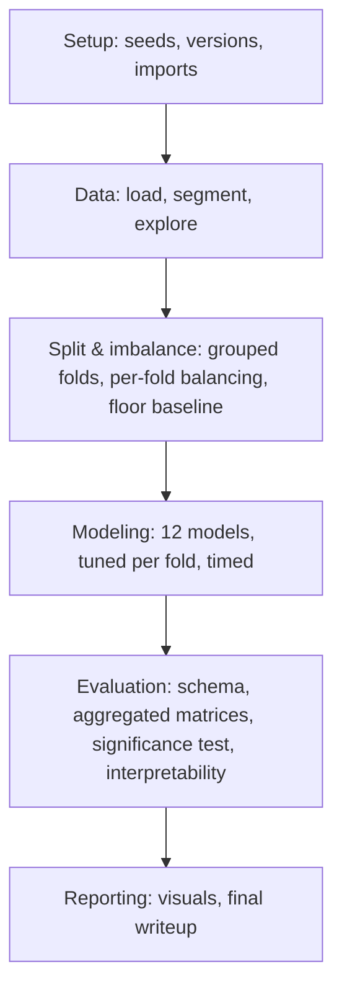

<div align="center">

# 🫀 DL for Arrhythmia Heartbeat Detection

**Patient-grouped benchmark of 12 classical and deep learning models for MIT-BIH arrhythmia beat classification, with leakage-safe cross-validation and statistical significance testing.**


</div>

---

## Why this project is different

Most tutorial-level MIT-BIH projects split individual *beats* randomly into train/test, letting the same patient's beats land on both sides — accuracy climbs past 99% without reflecting real generalization. This project uses **patient-grouped k-fold cross-validation** (`GroupKFold`, patient ID as the group), so no patient's beats ever cross the train/test boundary, and reports the results honestly:

- Mean ± standard deviation across ~10–12 folds, not a single point estimate
- Macro-F1 and per-class sensitivity — not just accuracy, since ~90% of beats are Normal and a model that always predicts "Normal" would score ~90% while being clinically useless
- A majority-class **floor baseline** reported alongside every real model, for scale
- Paired statistical tests (paired t-test / Wilcoxon) between top performers — not just a leaderboard
- Normalization and class-imbalance handling computed **per fold, on training patients only**, to avoid subtler leakage

## Pipeline



## Model lineup

12 models across 5 families, curated down from an initial 22 candidates — each one kept because it answers a question none of the others already answer.

| Family | Model | Role |
|---|---|---|
| Linear baseline | Logistic Regression | Sanity-check floor |
| Tree ensembles | Random Forest, Gradient Boosting | Strong classical benchmark |
| Distance-based | Support Vector Machine | Non-tree classical geometry |
| Feedforward NN | Multilayer Perceptron | Structure-agnostic control vs. 1D-CNN |
| Spatial / frequency | 1D-CNN, FFT-based 2D-CNN | Raw morphology vs. frequency representation |
| Sequence | Bidirectional LSTM | Multi-beat temporal context |
| Attention | CNN-Transformer Hybrid | Local shape + long-range dependency |
| Fusion | Fusion Model | Deep features + handcrafted features |
| Anomaly detection | Autoencoder | Bedside-monitor-style outlier flagging |
| Synthesis | Heterogeneous Ensemble | Combines top performers |
| Utility (unscored) | PCA | Preprocessing / cluster visualization only |

## Status

- [x] Phase A — Setup & reproducibility record
- [~] Phase B — Data loading & exploratory visualization *(in progress — annotation filtering / cleanup underway)*
- [ ] Phase C — Patient-grouped k-fold split & class imbalance handling
- [ ] Phase D — Train the 12-model lineup
- [ ] Phase E — Evaluation, aggregation, significance testing
- [ ] Phase F — Final report & results

## Dataset

[MIT-BIH Arrhythmia Database](https://physionet.org/content/mitdb/1.0.0/) — 48 half-hour, two-lead ECG recordings (~110,000 labeled beats), independently annotated by two or more cardiologists per beat. Beats follow the AAMI EC57 scheme: **N** (normal), **S** (supraventricular ectopic), **V** (ventricular ectopic), **F** (fusion), **Q** (unknown).

## Getting started

```bash
pip install wfdb numpy pandas matplotlib torch scikit-learn imbalanced-learn shap
```

```python
import wfdb
record = wfdb.rdrecord('100', pn_dir='mitdb')
annotation = wfdb.rdann('100', 'atr', pn_dir='mitdb')
```

## Citation

If you use the MIT-BIH Arrhythmia Database, please cite the original source:

> Moody GB, Mark RG. The impact of the MIT-BIH Arrhythmia Database. IEEE Eng in Med and Biol 20(3):45-50 (May-June 2001).

## License

_TBD — add a `LICENSE` file to specify usage terms._
