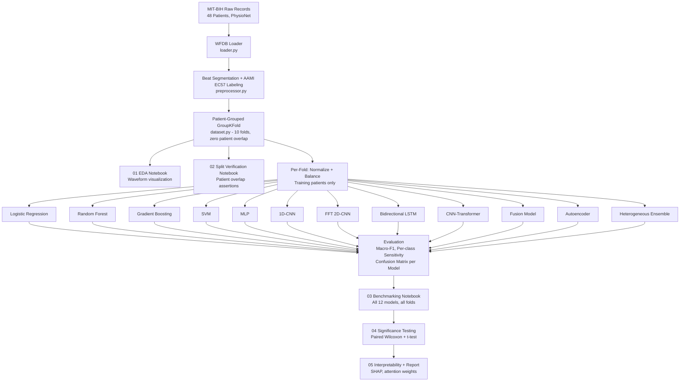

<div align="center">

# [♥] DL for Arrhythmia Heartbeat Detection

**Patient-grouped benchmark of 12 classical and deep learning models for MIT-BIH arrhythmia beat classification.**

[](.) [](./tests) [](https://python.org) [](https://pytorch.org) [](https://physionet.org/content/mitdb/1.0.0/) [](./src/ecg_arrhythmia/models) [](./src/ecg_arrhythmia)

</div>

---

## What This Is

A structured benchmark comparing 12 models (classical ML through deep learning) on ECG beat classification using the [MIT-BIH Arrhythmia Database](https://physionet.org/content/mitdb/1.0.0/). Every model is trained and tested identically under patient-grouped cross-validation, with statistical significance testing between top performers.

The entire project is structured as an installable Python package (`ecg_arrhythmia`) so all 12 model notebooks share the same preprocessing pipeline, data splits, and evaluation code without copy-pasting anything.

---

## Results (In Progress)

| Model | Macro-F1 | Accuracy | Mean ± Std |
|---|---|---|---|
| Logistic Regression | - | - | - |
| Random Forest | - | - | - |
| Gradient Boosting | - | - | - |
| SVM | - | - | - |
| MLP | - | - | - |
| 1D-CNN | - | - | - |
| FFT 2D-CNN | - | - | - |
| Bidirectional LSTM | - | - | - |
| CNN-Transformer | - | - | - |
| Fusion Model | - | - | - |
| Autoencoder | - | - | - |
| Heterogeneous Ensemble | - | - | - |
| **Majority-class Baseline** | - | ~90% | floor |

Results will be populated after Phase D training runs complete.

---

## Validation Methodology

Patient-grouped `GroupKFold` cross-validation (10 folds). Patient ID is the group key. No patient's beats appear in both train and test within any fold.

| Design Choice | Reason |
|---|---|
| Mean ± std across 10 folds | A single split gives one number with no variance estimate |
| Macro-F1 + per-class sensitivity | ~90% of beats are class N; accuracy alone hides total failure on rare classes |
| Majority-class baseline reported | Establishes the floor every model must beat to have diagnostic value |
| Paired Wilcoxon signed-rank test | Confirms whether performance differences between top models are real or fold noise |
| Per-fold normalization from training patients only | Whole-dataset normalization before splitting is a data leak |
| Fixed random seed (42) across all models | PyTorch, NumPy, and Python seeds set before every run for reproducible results |

---

## Pipeline



---

## Model Lineup

12 models selected from 22 candidates. Each model was kept only if it tests something no other model in the set already covers.

| Family | Model | Reason |
|---|---|---|
| Linear baseline | Logistic Regression | Minimum-complexity reference |
| Tree ensembles | Random Forest, Gradient Boosting | Classical tabular benchmark |
| Distance-based | SVM | Non-tree classical geometry |
| Feedforward NN | MLP | Isolates convolutional effect vs 1D-CNN |
| Spatial / frequency | 1D-CNN, FFT 2D-CNN | Raw morphology vs frequency-domain |
| Sequence | Bidirectional LSTM | Cross-beat temporal dependencies |
| Attention | CNN-Transformer Hybrid | Local morphology + long-range dependencies |
| Fusion | Fusion Model | Tests whether handcrafted features add anything beyond the deep path |
| Anomaly detection | Autoencoder | Outlier-flagging, distinct from direct classification |
| Synthesis | Heterogeneous Ensemble | Tests whether combining top models beats any single one |

---

## Reproducibility

All runs use a fixed seed set before every model:

```python
from ecg_arrhythmia.utils import set_seed
set_seed(42)  # Sets Python random, NumPy, PyTorch CPU and CUDA seeds
```

Fold splits are deterministic. Configs (hyperparameters, window sizes, fold count) live in `configs/` YAML files, not hardcoded. Raw data is downloaded and verified via checksum by `scripts/download_data.py`.

---

## Dataset

[MIT-BIH Arrhythmia Database](https://physionet.org/content/mitdb/1.0.0/). 48 half-hour two-lead ECG recordings, ~110,000 labeled beats, independently annotated by two or more cardiologists.

Beat labels follow **AAMI EC57**: N (normal), S (supraventricular ectopic), V (ventricular ectopic), F (fusion), Q (unknown/paced).

Class distribution is heavily imbalanced (~90% N). Per-class sensitivity on S, V, F, Q is the primary evaluation signal.

---

## Repository Structure

```text
DL-for-Arrhythmia-Heartbeat-Detection/
├── .github/workflows/ci.yml   # CI: ruff lint + pytest on Python 3.10/3.11/3.12
├── api/                        # FastAPI inference service (GET /health, POST /predict)
├── configs/                    # YAML configs for dataset and all 12 model hyperparameters
├── data/
│   ├── raw/mitdb/              # PhysioNet records (gitignored, use scripts/download_data.py)
│   ├── interim/                # Segmented beat arrays
│   └── processed/              # Leakage-free train/test fold tensors
├── docs/                       # ECG terminology reference, dev log
├── models/checkpoints/         # Saved .pt / .pkl weights
├── notebooks/
│   ├── archive/                # Original master notebook (frozen, replaced by below)
│   ├── 01_eda_and_waveform_analysis.ipynb
│   ├── 02_groupkfold_leakage_safe_splits.ipynb
│   ├── 03_model_benchmarking.ipynb
│   ├── 04_statistical_significance_testing.ipynb
│   └── 05_interpretability_and_reporting.ipynb
├── runs/                       # MLflow experiment tracking (local file store, gitignored)
├── scripts/                    # download_data.py, train.py, run_api.bat, run_jupyter.bat
├── src/ecg_arrhythmia/         # Installable Python package
│   ├── data/                   # Loader, AAMI EC57 mapper, beat extractor, GroupKFold splitter
│   ├── models/                 # 12 architectures + get_model("name") factory registry
│   ├── evaluation/             # Metrics, confusion matrices, significance tests
│   ├── inference/              # Predictor class shared by API and notebooks
│   ├── tracking/               # MLflow experiment logger wrapper
│   └── utils/                  # Seed setter, ECG and confusion matrix plots
└── tests/                      # 21 pytest tests (integrity, leakage, shapes, API, smoke)
```

---

## Getting Started

**Install:**
```bash
git clone https://github.com/your-username/DL-for-Arrhythmia-Heartbeat-Detection.git
cd DL-for-Arrhythmia-Heartbeat-Detection
pip install -e ".[dev]"
```

**Download dataset:**
```bash
python scripts/download_data.py
```

**Run tests:**
```bash
pytest tests/
```

**Launch notebooks:**
```bash
scripts\run_jupyter.bat
```

**Train a model from CLI:**
```bash
python scripts/train.py --model 1d_cnn --splits 5 --records 10 --epochs 5
```

Available model names: `logistic_regression` `random_forest` `gradient_boosting` `svm` `mlp` `1d_cnn` `fft_2d_cnn` `bilstm` `cnn_transformer` `fusion_model` `autoencoder` `heterogeneous_ensemble`

**Import in any notebook:**
```python
from ecg_arrhythmia.data import extract_all_beats, GroupKFoldSplitter
from ecg_arrhythmia.models import get_model
from ecg_arrhythmia.evaluation import compute_metrics
```

---

## Status

- [x] Phase A: Setup, seeds, reproducibility record
- [x] Phase B: Data loading, WFDB, AAMI EC57 annotation filtering, EDA
- [x] Phase B+: `src/ecg_arrhythmia` package, CI, 21 pytest tests, FastAPI inference service
- [ ] Phase C: 10-fold patient CV splits, per-fold normalization + class balancing, majority-class baseline; split data fed to 12 model notebooks via shared `ecg_arrhythmia.data` imports
- [ ] Phase D: Train all 12 models across all folds, log to MLflow
- [ ] Phase E: Evaluation, aggregated confusion matrices, paired significance tests
- [ ] Phase F: Final report, SHAP interpretability, visualizations

---

## Citation

> Moody GB, Mark RG. The impact of the MIT-BIH Arrhythmia Database. IEEE Eng in Med and Biol 20(3):45-50 (May-June 2001).
