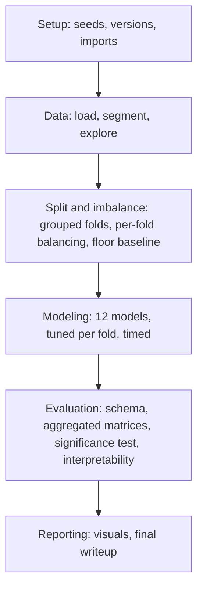

<div align="center">

# [♥] DL for Arrhythmia Heartbeat Detection

**Patient-grouped benchmark of 12 classical and deep learning models for MIT-BIH arrhythmia beat classification, with leakage-safe cross-validation and statistical significance testing.**


</div>

---

## Validation methodology

This project uses patient-grouped k-fold cross-validation (`GroupKFold`, patient ID as the group). No patient's beats appear in both the training and test sets within a fold.

Reasoning for each design choice:

- **Mean and standard deviation across 10-12 folds, not a single point estimate.** A single split gives one accuracy number with no measure of variance across patients.
- **Macro-F1 and per-class sensitivity reported alongside accuracy.** Roughly 90% of beats are class N (normal). A model predicting N for every beat scores about 90% accuracy while providing no diagnostic value. Accuracy alone does not surface this failure mode.
- **Majority-class baseline reported with every model.** Establishes a floor so relative model performance is interpretable.
- **Paired statistical tests (paired t-test or Wilcoxon signed-rank) between top-performing models.** Confirms whether a performance difference is significant rather than fold-to-fold noise.
- **Normalization and class-imbalance handling computed per fold, using training-patient statistics only.** Computing these over the full dataset before splitting leaks test-set information into training.

## Pipeline



## Model lineup

12 models selected from an initial pool of 22 candidates. Each model was retained only if it tests something not already covered by another model in the set.

| Family | Model | Reason for inclusion |
|---|---|---|
| Linear baseline | Logistic Regression | Minimum-complexity reference point |
| Tree ensembles | Random Forest, Gradient Boosting | Established classical benchmark on tabular/feature input |
| Distance-based | Support Vector Machine | Classical geometry not covered by tree-based methods |
| Feedforward NN | Multilayer Perceptron | Isolates the effect of convolutional structure by comparison to 1D-CNN |
| Spatial / frequency | 1D-CNN, FFT-based 2D-CNN | Compares raw-morphology learning to frequency-domain representation |
| Sequence | Bidirectional LSTM | Models dependencies across multiple beats, not a single beat in isolation |
| Attention | CNN-Transformer Hybrid | Combines local morphology with long-range dependency modeling |
| Fusion | Fusion Model | Tests whether handcrafted features add information beyond the deep path |
| Anomaly detection | Autoencoder | Outlier-flagging approach, distinct from direct classification |
| Synthesis | Heterogeneous Ensemble | Tests whether combining top models improves on any single model |
| Utility (unscored) | PCA | Used for preprocessing and cluster visualization, not evaluated as a detector |

## Status

- [x] Phase A: Setup and reproducibility record
- [x] Phase B: Data loading and exploratory visualization (in progress, annotation filtering and cleanup underway)
- [ ] Phase C: Patient-grouped k-fold split and class imbalance handling
- [ ] Phase D: Train the 12-model lineup
- [ ] Phase E: Evaluation, aggregation, significance testing
- [ ] Phase F: Final report and results

## Dataset

[MIT-BIH Arrhythmia Database](https://physionet.org/content/mitdb/1.0.0/). 48 half-hour, two-lead ECG recordings, approximately 110,000 labeled beats, each independently annotated by two or more cardiologists. Beats follow the AAMI EC57 scheme: N (normal), S (supraventricular ectopic), V (ventricular ectopic), F (fusion), Q (unknown).

## Getting started

```bash
pip install wfdb numpy pandas matplotlib torch scikit-learn imbalanced-learn shap
```

```python
import wfdb
record = wfdb.rdrecord('100', pn_dir='mitdb')
annotation = wfdb.rdann('100', 'atr', pn_dir='mitdb')
```

## Citation

> Moody GB, Mark RG. The impact of the MIT-BIH Arrhythmia Database. IEEE Eng in Med and Biol 20(3):45-50 (May-June 2001).
